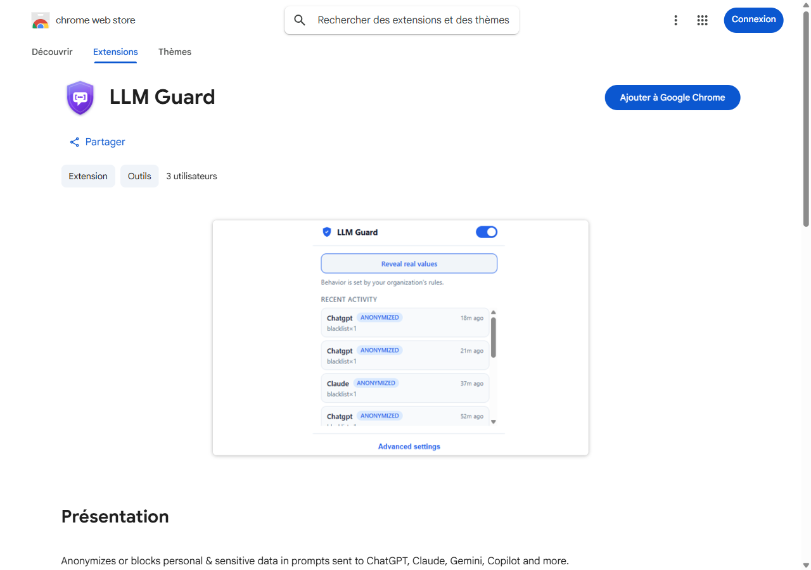

# Manuel d'utilisation — LLM Guard

*Guide d'installation et d'utilisation pour tous — aucune compétence technique requise.*

---

## 1. Qu'est-ce que LLM Guard ?

**LLM Guard** est une petite extension qui s'ajoute à votre navigateur Chrome. Son rôle est de **protéger vos données personnelles et confidentielles** lorsque vous utilisez des intelligences artificielles comme **ChatGPT, Claude, Gemini ou Copilot**.

Concrètement, avant que votre message ne soit envoyé à l'IA, LLM Guard l'analyse. S'il repère des informations sensibles (par exemple une adresse e-mail, un numéro de téléphone, un numéro de carte bancaire, un nom de client…), il peut, selon les règles définies :

- **Masquer** l'information (elle est remplacée par une étiquette du type `[EMAIL_a1b2]`), puis vous permettre de la **réafficher** d'un simple clic ;
- **Vous avertir** qu'une donnée sensible a été détectée ;
- **Bloquer** l'envoi du message pour éviter toute fuite.

> 💡 **En bref :** LLM Guard agit comme un filet de sécurité entre vous et les outils d'IA, pour éviter d'envoyer par accident des informations qui devraient rester privées.

---

## 2. Avant de commencer

Vous avez seulement besoin de :

- Un ordinateur (Windows, Mac ou Linux) ;
- Le navigateur **Google Chrome** installé (voir la section sur la compatibilité plus bas) ;
- Une connexion à Internet.

⏱️ **Durée de l'installation : environ 2 minutes.**

---

## 3. Installation pas à pas

### Étape 1 — Ouvrir la page de l'extension

Cliquez sur le lien suivant (ou copiez-le dans la barre d'adresse de Chrome) :

👉 **https://chromewebstore.google.com/detail/llm-guard/mdpmkemlgjknjgcogdlmpjdninnihfnn**

Cette page est le **Chrome Web Store**, la boutique officielle et sécurisée de Google pour les extensions.



### Étape 2 — Lancer l'installation

Sur la page, cliquez sur le bouton bleu **« Ajouter à Google Chrome »** (en haut à droite, voir l'image ci-dessus).

### Étape 3 — Confirmer

Une petite fenêtre apparaît et vous demande confirmation, en listant les autorisations dont l'extension a besoin.
Cliquez sur **« Ajouter l'extension »**.

L'installation se fait automatiquement en quelques secondes. ✅

### Étape 4 — Vérifier que l'extension est bien installée

En haut à droite de Chrome, à côté de la barre d'adresse, vous verrez l'icône **🧩 (pièce de puzzle)**. Si vous cliquez dessus, **LLM Guard** doit apparaître dans la liste. C'est bon signe : l'extension est installée. ✅

---

## 4. Épingler l'extension (la rendre toujours visible)

Par défaut, l'icône de LLM Guard est « cachée » derrière l'icône 🧩. Pour l'afficher en permanence à côté de la barre d'adresse — c'est plus pratique au quotidien — épinglez-la :

1. Cliquez sur l'icône **🧩 (pièce de puzzle)**, en haut à droite de Chrome.
2. La liste de vos extensions s'ouvre. Repérez la ligne **LLM Guard**.
3. À droite de cette ligne, cliquez sur la petite **punaise 📌**.
   - Quand la punaise devient **bleue**, l'extension est épinglée. 🎉
4. L'icône en forme de **bouclier 🛡️** de LLM Guard s'affiche maintenant en permanence à côté de la barre d'adresse.

> 💡 Pour **désépingler** plus tard, recliquez simplement sur la punaise (elle redeviendra grise).

```
   Barre d'adresse de Chrome (en haut à droite)
   ┌─────────────────────────────────────────────┐
   │  …  🛡️   🧩   ⋮                              │
   │      ▲    ▲                                   │
   │      │    └── icône 🧩 : liste des extensions │
   │      └─────── LLM Guard épinglé (bouclier)    │
   └─────────────────────────────────────────────┘
```

---

## 5. Gérer l'extension au quotidien

### A. Le menu rapide (clic gauche sur l'icône 🛡️)
Un **clic gauche** sur l'icône bouclier ouvre la petite fenêtre (le « popup ») de LLM Guard. Vous y trouvez :

- l'**interrupteur** pour activer ou désactiver la protection ;
- le bouton **« Révéler / Masquer »** (pour réafficher vos vraies informations dans la page) ;
- vos **statistiques** et l'**activité récente**.

### B. Le menu de gestion (clic droit sur l'icône 🛡️)
Un **clic droit** sur l'icône donne accès à des options de gestion, notamment :

- **« Gérer l'extension »** — ouvre la page de réglages de l'extension ;
- **« Options »** — ouvre les réglages avancés (réservés plutôt au service informatique) ;
- **« Retirer de Chrome »** — pour désinstaller l'extension.

### C. La page « Gérer les extensions » (vue complète)
Pour tout gérer depuis un seul endroit :

1. Cliquez sur l'icône **🧩**, puis sur **« Gérer les extensions »** en bas du menu.
   *(Ou tapez `chrome://extensions` dans la barre d'adresse, puis appuyez sur Entrée.)*
2. Sur la carte **LLM Guard**, vous pouvez :
   - **Activer / Désactiver** l'extension avec l'interrupteur bleu (sans la désinstaller) ;
   - cliquer sur **« Détails »** pour voir les autorisations et choisir sur quels sites elle s'active ;
   - cliquer sur **« Supprimer »** pour la désinstaller complètement.

---

## 6. Premiers pas : comment l'utiliser

L'extension fonctionne **automatiquement**. Vous n'avez rien à faire de spécial une fois installée.

1. Rendez-vous sur un service d'IA, par exemple **chatgpt.com** ou **claude.ai**.
2. **Rechargez la page** une fois (touche `F5`, ou `Ctrl + Maj + R`) pour que la protection s'active.
3. Écrivez votre message comme d'habitude et envoyez-le.

Si une information sensible est détectée :

- Une **petite notification** apparaît à l'écran pour vous prévenir ;
- L'information peut être automatiquement **masquée** (remplacée par une étiquette comme `[PHONE_1a2b]`) ;
- La réponse de l'IA conservera ces étiquettes.

### Réafficher les vraies valeurs

Pour revoir vos informations d'origine dans la conversation :

1. Cliquez sur l'icône **LLM Guard** (en haut à droite de Chrome).
2. Dans la petite fenêtre qui s'ouvre (le « popup »), cliquez sur le bouton **« Révéler / Masquer »**.
3. Les étiquettes sont alors remplacées par les vraies valeurs directement dans la page. Recliquez pour les masquer à nouveau.

Depuis cette même fenêtre, vous pouvez aussi :

- **Activer ou désactiver** la protection grâce à l'interrupteur ;
- Consulter quelques **statistiques** (nombre de détections) et l'activité récente.

---

## 7. ⚠️ Compatibilité : Chrome uniquement

> **Important : LLM Guard fonctionne uniquement sur Google Chrome et les navigateurs de la même famille (dits « Chromium »).**

| Navigateur | Compatible ? |
|------------|:------------:|
| **Google Chrome** | ✅ Oui |
| **Microsoft Edge** | ✅ Oui (basé sur Chromium) |
| **Brave** | ✅ Oui (basé sur Chromium) |
| **Opera** | ✅ Oui (basé sur Chromium) |
| **Mozilla Firefox** | ❌ Non |
| **Apple Safari** | ❌ Non |

**Pourquoi ?** L'extension a été conçue spécifiquement pour la technologie de Chrome (Chromium). Les navigateurs **Safari** (sur Mac et iPhone) et **Firefox** utilisent une technologie différente et **ne peuvent pas installer cette extension**.

👉 Si vous utilisez Safari ou Firefox, vous devez d'abord installer **Google Chrome** (gratuit) pour pouvoir utiliser LLM Guard.

---

## 8. Autres limitations à connaître

Pour utiliser l'outil en toute confiance, gardez à l'esprit les points suivants :

### 📱 Ordinateur uniquement, pas de mobile
L'extension fonctionne sur **ordinateur** (Windows, Mac, Linux). Elle **ne fonctionne pas** sur les applications mobiles de Chrome (téléphones et tablettes Android ou iPhone/iPad), car celles-ci n'autorisent pas les extensions.

### 🌐 Seulement sur certains sites d'IA
LLM Guard protège uniquement les services d'IA **pris en charge** (par exemple ChatGPT, Claude, Gemini, Copilot). Sur les autres sites web, l'extension reste inactive.

### 🔄 Pensez à recharger la page
Juste après l'installation (ou après l'activation/désactivation), il faut **recharger la page** du service d'IA pour que la protection s'applique. Une page déjà ouverte avant l'installation n'est pas protégée tant qu'elle n'a pas été rechargée.

### 🧠 La détection n'est pas infaillible
La détection repose sur des **règles** (formats d'e-mail, de téléphone, mots-clés, etc.). Elle est très utile, mais :
- elle peut **manquer** une information sensible rédigée d'une manière inhabituelle ;
- elle peut parfois **signaler à tort** un texte qui n'est pas réellement sensible.
LLM Guard est une **aide**, pas une garantie absolue : restez toujours vigilant sur ce que vous partagez.

### 👁️ Le « démasquage » est manuel
Contrairement à ce qu'on pourrait croire, l'extension ne réaffiche **pas** automatiquement vos informations dans la réponse de l'IA. Vous devez cliquer vous-même sur le bouton **« Révéler / Masquer »** pour voir les vraies valeurs.

### 🏢 Règles personnalisables (usage avancé)
Les règles de détection peuvent être adaptées par votre organisation (service informatique / délégué à la protection des données). Selon la configuration mise en place, le comportement (masquer, avertir ou bloquer) peut donc varier d'une entreprise à l'autre.

### 🔒 Vos données restent chez vous
L'analyse se fait **localement, dans votre navigateur**. L'extension n'envoie pas vos messages vers un serveur externe pour les analyser.

---

## 9. Questions fréquentes (FAQ)

**❓ L'extension est-elle gratuite ?**
Oui, l'installation depuis le Chrome Web Store est gratuite.

**❓ Vais-je remarquer un ralentissement ?**
Non. L'analyse est quasi instantanée et n'affecte pas votre navigation.

**❓ Comment désactiver temporairement la protection ?**
Cliquez sur l'icône LLM Guard puis basculez l'interrupteur sur « désactivé ». Rechargez la page pour appliquer.

**❓ Comment désinstaller l'extension ?**
Faites un clic droit sur l'icône LLM Guard (ou l'icône 🧩 puis le menu « ⋮ » à côté de LLM Guard) et choisissez **« Retirer de Chrome »**.

**❓ Je ne vois pas l'icône de l'extension.**
Cliquez sur l'icône 🧩 (pièce de puzzle) à droite de la barre d'adresse, puis épinglez LLM Guard avec la punaise 📌.

**❓ La protection ne se déclenche pas.**
Vérifiez que : (1) vous êtes bien sur un site d'IA pris en charge, (2) la protection est activée dans le popup, (3) vous avez rechargé la page après l'installation.

